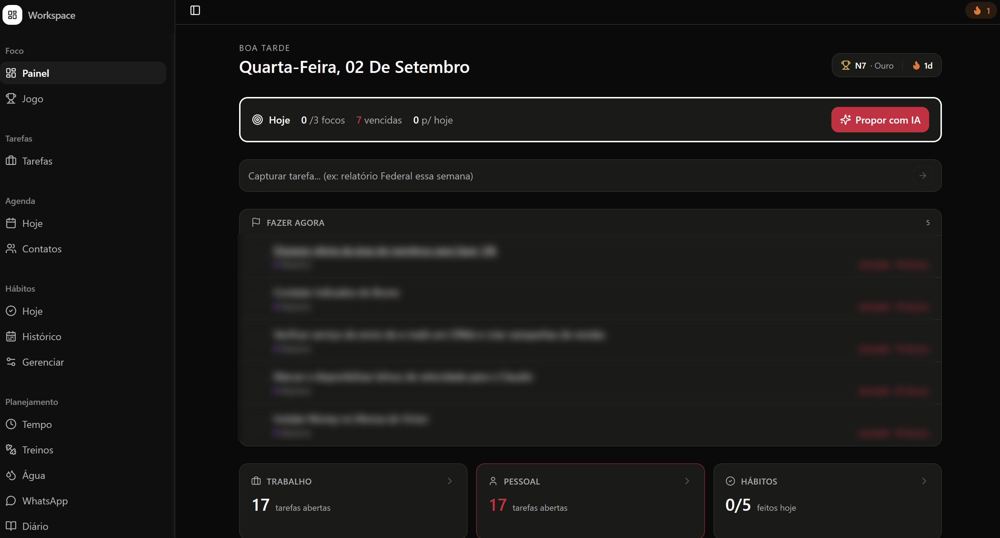
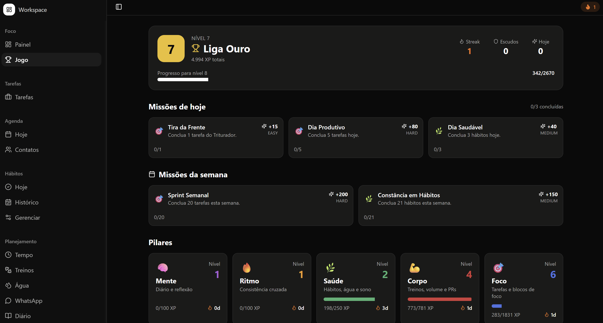
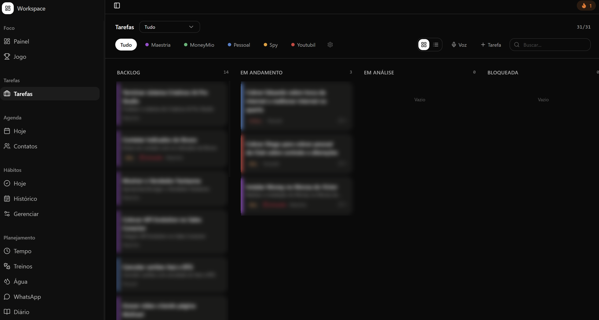
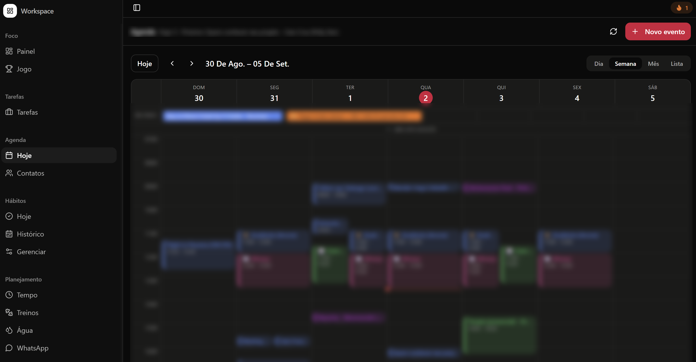
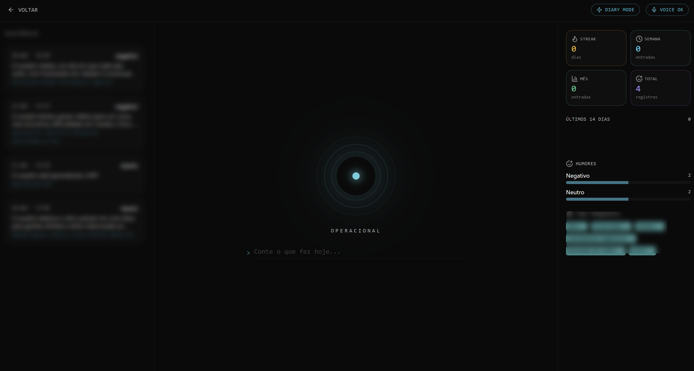

# Assist ✅

> Seu dia a dia num só lugar: tarefas, hábitos, água, humor e treinos, com IA priorizando o que importa e gamificação pra manter a constância.

<table>
<tr>
<td width="50%"> Painel</td>
<td width="50%"> Jogo (gamificação)</td>
</tr>
<tr>
<td width="50%"> Tarefas</td>
<td width="50%"> Agenda</td>
</tr>
<tr>
<td width="50%"> Diário</td>
<td width="50%"></td>
</tr>
</table>

> Os prints com dados reais (tarefas, compromissos e entradas de diário) têm blur proposital — é o meu uso pessoal do dia a dia.

## O problema

A vida fica espalhada em mil apps: um pra tarefa, outro pra hábito, outro pra treino. No fim, ninguém mantém nenhum — e decidir por onde começar o dia consome mais energia do que executar.

## A solução

O Assist centraliza o acompanhamento do dia: você registra tarefas, hábitos, consumo de água, humor e treinos, e a IA ajuda a decidir a prioridade do dia. O sistema transforma constância em progresso visível, estilo game.

## Funcionalidades

- **Triturador de Tarefas (IA)**: propõe um "Top 3" do dia com base nas tarefas em aberto, com opção de confirmar, adiar ou trocar a sugestão
- **Tarefas**: quadro kanban (backlog, em andamento, em análise, bloqueada) organizado por projeto/área, com prioridade e prazo
- **Jogo**: camada de gamificação própria — nível, liga, XP, missões diárias e semanais, e pilares de evolução (Mente, Ritmo, Saúde, Corpo, Foco)
- **Hábitos**: criação, streak de constância e histórico completo
- **Água**: meta diária em litros, registro por garrafa e calendário do mês
- **Treinos**: sessões por modalidade, volume e duração, com progressão ao longo do tempo
- **Agenda e contatos**: visão semanal dos compromissos, eventos de dia inteiro e blocos de tempo
- **Tempo**: timeline do dia com sono, blocos de foco e radar de atividade por período
- **Diário**: registro de texto ou voz, com análise de humor por IA, tags recorrentes e histórico
- **Gamificação**: sistema de XP, níveis e streaks pra manter o ritmo

## Stack

`React` `TypeScript` `Supabase (Postgres · Auth · RLS)` `IA (LLM)`

## Status

🚧 Produto próprio em evolução.

> 🔒 Este repositório é a vitrine do produto. O código-fonte é privado.

---

Feito por [Caio Cruz](https://github.com/CaiioFe) · [iacaio.com.br](https://iacaio.com.br)
